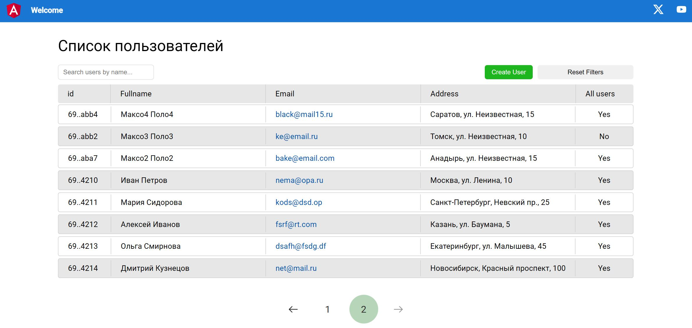
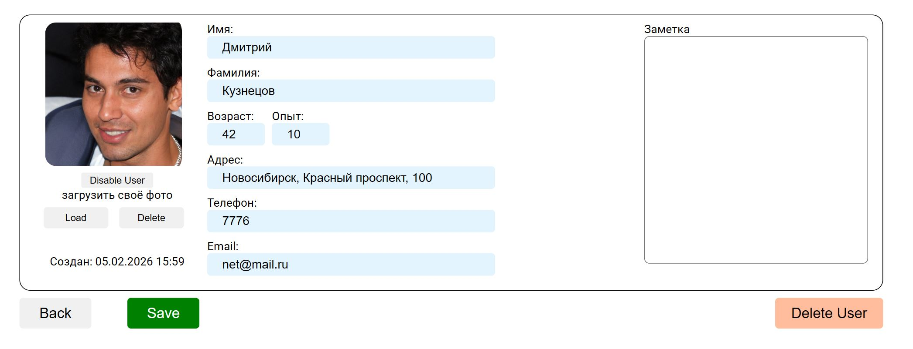
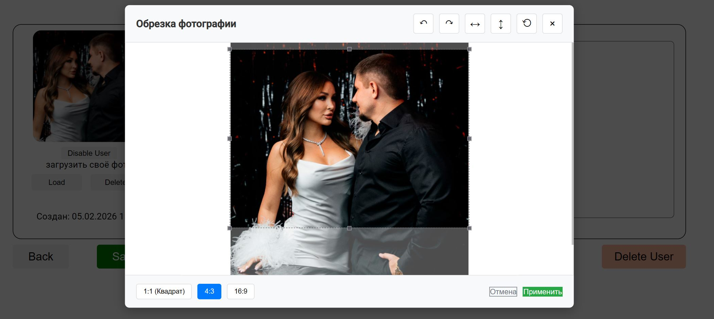

# ListUsers2

Angular version 16.
используется бек написанный на JS (Node.js).

1. Отображает список пользователей
   - работает с таблицей Users, полями (MongoDB)
   - id, firstName, lastName, avatar, age, experience, address, phone, email, active
2. Добавлено поле поиска, которое при появлении (символ > 2) отправляет запрос бэкенд, а результат отображается списком (если длинный то так же присутвует пагинация).
3. Список для фильтрации: показать всех, только активных или только неактивных пользователей.
4. При клике на пользователя выводит его данные в отдельном блоке.
5. Возможность редактировать данные пользователей.
6. Создавать и удалять пользователя.
7. Загружать аватарку для пользователя, выбирать зону в картинке которую хотелось бы установить в аватар.

| Скрины сайта                                        |
|-----------------------------------------------------|
|  |
|  |
|  |
